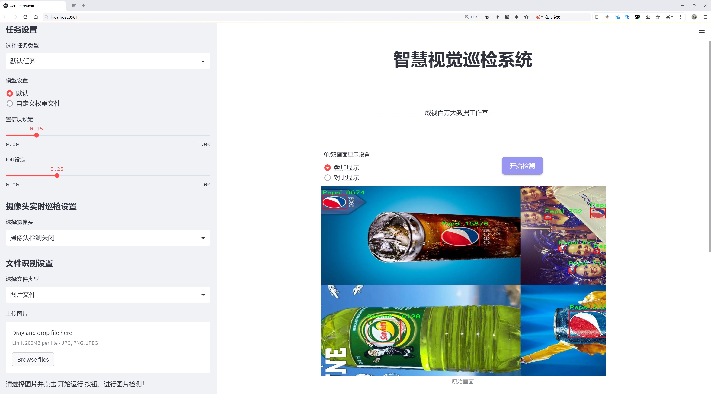
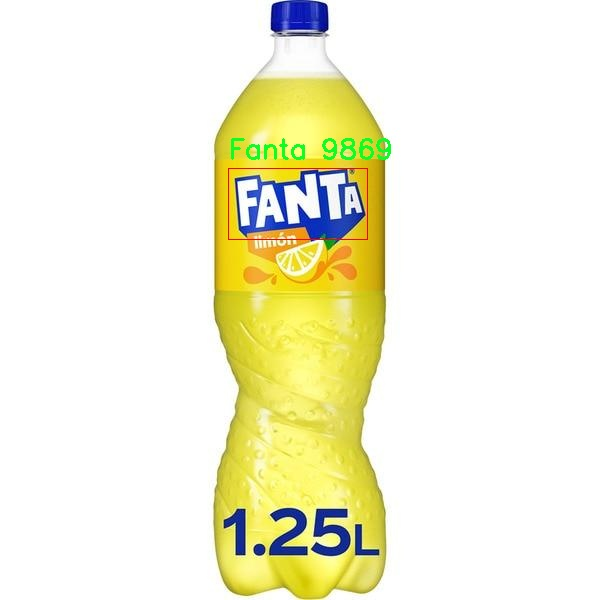

# 品牌标志识别检测系统源码分享
 # [一条龙教学YOLOV8标注好的数据集一键训练_70+全套改进创新点发刊_Web前端展示]

### 1.研究背景与意义

项目参考[AAAI Association for the Advancement of Artificial Intelligence](https://gitee.com/qunmasj/projects)

研究背景与意义

随着全球经济的快速发展和市场竞争的日益激烈，品牌标志作为企业形象的重要组成部分，扮演着至关重要的角色。品牌标志不仅是企业识别的重要标志，更是消费者对品牌认知和忠诚度的直接体现。近年来，随着信息技术的飞速发展，尤其是计算机视觉和深度学习技术的不断进步，品牌标志的自动识别与分类成为了一个备受关注的研究领域。基于此背景，构建一个高效、准确的品牌标志识别系统显得尤为重要。

在现有的品牌标志识别研究中，YOLO（You Only Look Once）系列模型因其优越的实时检测能力和较高的准确率而广泛应用。YOLOv8作为该系列的最新版本，具备了更强的特征提取能力和更快的推理速度，为品牌标志的识别提供了良好的技术基础。然而，现有的YOLOv8模型在特定领域的应用上仍存在一定的局限性，尤其是在品牌标志的多样性和复杂性方面。因此，基于改进YOLOv8的品牌标志识别系统的研究，具有重要的理论价值和实际意义。

本研究所使用的数据集“logosV3”包含8778张图像，涵盖了11个品牌类别，包括Coca-Cola、Pepsi、Fanta等知名品牌。这一数据集的丰富性和多样性为模型的训练和测试提供了良好的基础。通过对这些品牌标志的识别，不仅可以提高品牌标志识别的准确性，还可以为后续的品牌监测、市场分析等应用提供支持。此外，随着社交媒体和电子商务的普及，品牌标志的在线传播和识别变得愈发重要，基于深度学习的品牌标志识别系统将为企业提供实时的品牌监测和舆情分析工具，帮助企业更好地理解市场动态和消费者需求。

此外，品牌标志识别系统的研究还具有广泛的应用前景。在广告投放、市场营销、品牌保护等领域，准确的品牌标志识别能够帮助企业优化资源配置，提高营销效果。同时，在知识产权保护方面，品牌标志的自动识别也能够有效防止侵权行为，维护企业的合法权益。因此，基于改进YOLOv8的品牌标志识别系统的研究，不仅具有重要的学术价值，也为企业的实际应用提供了可行的解决方案。

综上所述，基于改进YOLOv8的品牌标志识别系统的研究，不仅能够推动计算机视觉和深度学习技术在品牌识别领域的应用发展，还能为企业提供更为高效的品牌管理工具，具有重要的理论意义和实践价值。通过对品牌标志的深入研究和系统构建，期望能够为品牌识别技术的发展贡献新的思路和方法，为相关领域的研究提供有益的借鉴。

### 2.图片演示




##### 注意：由于此博客编辑较早，上面“2.图片演示”和“3.视频演示”展示的系统图片或者视频可能为老版本，新版本在老版本的基础上升级如下：（实际效果以升级的新版本为准）

  （1）适配了YOLOV8的“目标检测”模型和“实例分割”模型，通过加载相应的权重（.pt）文件即可自适应加载模型。

  （2）支持“图片识别”、“视频识别”、“摄像头实时识别”三种识别模式。

  （3）支持“图片识别”、“视频识别”、“摄像头实时识别”三种识别结果保存导出，解决手动导出（容易卡顿出现爆内存）存在的问题，识别完自动保存结果并导出到。

  （4）支持Web前端系统中的标题、背景图等自定义修改，后面提供修改教程。

  另外本项目提供训练的数据集和训练教程,暂不提供权重文件（best.pt）,需要您按照教程进行训练后实现图片演示和Web前端界面演示的效果。

### 3.视频演示

[3.1 视频演示](https://www.bilibili.com/video/BV1FnW2eJEXe/?vd_source=ff015de2d29cbe2a9cdbfa7064407a08)

### 4.数据集信息展示

数据集信息展示

在现代计算机视觉领域，品牌标志识别作为一个重要的研究方向，受到了广泛的关注。为了提升这一领域的技术水平，特别是针对YOLOv8模型的改进，构建一个高质量的数据集显得尤为重要。我们在此展示的数据集名为“logosV3”，它为品牌标志识别任务提供了丰富的资源，旨在为研究人员和开发者提供一个强大的基础，以便于训练和优化他们的模型。

该数据集包含8778张图像，涵盖了11个不同的品牌标志类别。这些类别包括广为人知的品牌，如可口可乐（Coca-Cola）、芬达（Fanta）、百事可乐（Pepsi）等，此外还包括一些地方品牌如Pacena和Salvieti。这种多样性不仅增强了数据集的实用性，也为模型的泛化能力提供了良好的基础。每个类别的标志在图像中以不同的角度、光照条件和背景出现，这为模型的训练提供了丰富的样本，有助于提高其在实际应用中的表现。

在数据集的构建过程中，图像的选择和标注都经过严格的审核，以确保数据的准确性和可靠性。每个品牌标志都经过精确的标注，确保模型在训练过程中能够准确识别和分类。这种高质量的标注对于YOLOv8模型的训练至关重要，因为它能够帮助模型学习到更为细致的特征，从而提高其检测精度。

该数据集遵循CC BY 4.0许可证，这意味着用户可以自由使用、修改和分发数据集，只需适当引用原作者。这种开放的许可证政策鼓励了学术界和工业界的合作，促进了知识的共享与传播。研究人员可以基于此数据集进行各种实验，探索不同的模型架构和训练策略，以期找到最佳的品牌标志识别解决方案。

此外，logosV3数据集的设计也考虑到了多样化的应用场景。无论是在广告监测、市场分析，还是在智能手机应用中，品牌标志识别都能发挥重要作用。通过使用该数据集，研究人员可以开发出更为智能的系统，帮助企业更好地理解消费者行为和市场动态。

总之，logosV3数据集为品牌标志识别的研究提供了一个坚实的基础。它不仅涵盖了丰富的图像数据和多样的品牌类别，还通过高质量的标注和开放的使用许可，鼓励了广泛的研究和应用。随着YOLOv8模型的不断改进，利用该数据集进行训练将为品牌标志识别技术的进步提供强有力的支持，推动相关领域的发展。





### 5.全套项目环境部署视频教程（零基础手把手教学）

[5.1 环境部署教程链接（零基础手把手教学）](https://www.ixigua.com/7404473917358506534?logTag=c807d0cbc21c0ef59de5)


[5.2 安装Python虚拟环境创建和依赖库安装视频教程链接（零基础手把手教学）](https://www.ixigua.com/7404474678003106304?logTag=1f1041108cd1f708b01a)

### 6.手把手YOLOV8训练视频教程（零基础小白有手就能学会）

[6.1 环境部署教程链接（零基础手把手教学）](https://www.ixigua.com/7404477157818401292?logTag=d31a2dfd1983c9668658)

### 7.70+种全套YOLOV8创新点代码加载调参视频教程（一键加载写好的改进模型的配置文件）

[7.1 环境部署教程链接（零基础手把手教学）](https://www.ixigua.com/7404478314661806627?logTag=29066f8288e3f4eea3a4)

### 8.70+种全套YOLOV8创新点原理讲解（非科班也可以轻松写刊发刊，V10版本正在科研待更新）

由于篇幅限制，每个创新点的具体原理讲解就不一一展开，具体见下列网址中的创新点对应子项目的技术原理博客网址【Blog】：


[8.1 70+种全套YOLOV8创新点原理讲解链接](https://gitee.com/qunmasj/good)

### 9.系统功能展示（检测对象为举例，实际内容以本项目数据集为准）

图1.系统支持检测结果表格显示

  图2.系统支持置信度和IOU阈值手动调节

  图3.系统支持自定义加载权重文件best.pt(需要你通过步骤5中训练获得)

  图4.系统支持摄像头实时识别

  图5.系统支持图片识别

  图6.系统支持视频识别

  图7.系统支持识别结果文件自动保存

  图8.系统支持Excel导出检测结果数据


### 10.原始YOLOV8算法原理

原始YOLOv8算法原理

YOLOv8算法是目标检测领域的一个重要进展，由Glenn-Jocher提出，延续了YOLO系列算法的优良传统，尤其是YOLOv3和YOLOv5的设计理念。该算法在多个方面进行了创新和改进，旨在提高目标检测的准确性和效率。YOLOv8的设计理念不仅关注于模型的性能提升，还考虑到实际应用中的灵活性和可扩展性。

首先，YOLOv8在数据预处理方面延续了YOLOv5的策略，采用了多种数据增强技术以提高模型的泛化能力。具体而言，YOLOv8引入了马赛克增强、混合增强、空间扰动和颜色扰动等手段。这些增强方法通过对训练数据进行多样化处理，能够有效减少模型对特定数据分布的依赖，从而提升模型在不同场景下的适应性。马赛克增强通过将多张图像拼接在一起，增加了图像的多样性，而混合增强则通过将不同图像的特征进行融合，进一步丰富了训练样本的特征空间。这些数据预处理策略为YOLOv8提供了更为丰富的训练数据，进而提高了模型的检测性能。

在骨干网络结构方面，YOLOv8继承了YOLOv5的设计理念，但进行了显著的优化。YOLOv5的主干网络采用了清晰的层次结构，通过使用步长为2的3×3卷积层进行特征图的降采样，并接入C3模块以增强特征提取能力。YOLOv8则将C3模块替换为新的C2f模块，C2f模块通过引入更多的分支结构，增强了梯度回传时的特征流动性。这种设计不仅提高了模型的特征提取能力，还减少了模型的计算复杂度，使得YOLOv8在保持高效性的同时，能够更好地捕捉到图像中的重要特征。

YOLOv8的特征金字塔网络（FPN）和路径聚合网络（PAN）结构依然是其核心组成部分。FPN和PAN的结合使得多尺度信息能够得到充分融合，提升了模型对不同尺寸目标的检测能力。YOLOv8在这一结构中对C3模块进行了替换，使用C2f模块来增强特征融合的效果。这种改进使得YOLOv8在处理复杂场景时，能够更好地捕捉到目标的多样性和变化性，从而提高检测的准确性。

检测头的设计也是YOLOv8的一大亮点。YOLOv3和YOLOv5的检测头采用了耦合结构，而YOLOv8则引入了解耦头的概念。这种结构将分类和定位任务分为两个并行的分支，各自使用1×1卷积进行处理。通过这种解耦设计，YOLOv8能够更有效地提取类别特征和位置特征，进而提高目标检测的精度和效率。

在标签分配策略方面，YOLOv8摒弃了YOLOv5的候选框聚类方法，转而采用了一种动态标签分配策略。该策略与YOLOv6的TOOD策略相似，主要通过目标框和目标分数进行动态匹配。这种方法能够更好地适应不同数据集的特征，避免了候选框聚类可能带来的不准确性。YOLOv8的损失函数设计也进行了创新，采用了变焦损失（VFL Loss）来计算分类损失，同时结合CIoULoss和DFLLoss来处理边界框的回归损失。这种损失函数的设计使得模型在训练过程中能够更加关注高质量的正样本，从而提高整体的检测性能。

YOLOv8在算法思想上，依然延续了跨级结构（CSP）的设计理念，通过优化C3模块，采用更轻量的C2f结构，保持了模型的高效性和准确性。此外，YOLOv8还引入了空间金字塔池化模块，以增强特征提取的能力。通过这一系列的改进，YOLOv8不仅在检测速度上有了显著提升，同时在准确性上也达到了新的高度。

综上所述，YOLOv8算法在数据预处理、骨干网络结构、特征融合、检测头设计以及标签分配策略等多个方面进行了全面的优化。这些改进使得YOLOv8在目标检测任务中表现出色，成为当前最为先进的目标检测算法之一。通过高效的特征提取和灵活的检测策略，YOLOv8能够在多种应用场景中实现高效、准确的目标检测，为实际应用提供了强有力的支持。


### 11.项目核心源码讲解（再也不用担心看不懂代码逻辑）

#### 11.1 ui.py

以下是对代码的核心部分进行保留和详细注释的版本：

```python
import sys
import subprocess

def run_script(script_path):
    """
    使用当前 Python 环境运行指定的脚本。

    Args:
        script_path (str): 要运行的脚本路径

    Returns:
        None
    """
    # 获取当前 Python 解释器的路径
    python_path = sys.executable

    # 构建运行命令，使用 streamlit 运行指定的脚本
    command = f'"{python_path}" -m streamlit run "{script_path}"'

    # 执行命令并等待其完成
    result = subprocess.run(command, shell=True)
    
    # 检查命令执行的返回码，非零表示出错
    if result.returncode != 0:
        print("脚本运行出错。")

# 主程序入口
if __name__ == "__main__":
    # 指定要运行的脚本路径
    script_path = "web.py"  # 这里可以直接指定脚本名，假设它在当前目录下

    # 调用函数运行脚本
    run_script(script_path)
```

### 代码注释说明：
1. **导入模块**：
   - `sys`：用于获取当前 Python 解释器的路径。
   - `subprocess`：用于执行外部命令。

2. **`run_script` 函数**：
   - 接受一个参数 `script_path`，表示要运行的 Python 脚本的路径。
   - 使用 `sys.executable` 获取当前 Python 解释器的路径，以确保使用正确的 Python 环境来运行脚本。
   - 构建命令字符串，使用 `streamlit` 模块运行指定的脚本。
   - 使用 `subprocess.run` 执行命令，并通过 `shell=True` 允许在 shell 中执行命令。
   - 检查命令的返回码，如果返回码不为零，表示脚本运行出错，打印错误信息。

3. **主程序入口**：
   - 使用 `if __name__ == "__main__":` 确保只有在直接运行该脚本时才会执行下面的代码。
   - 指定要运行的脚本路径，这里假设脚本 `web.py` 在当前目录下。
   - 调用 `run_script` 函数来执行指定的脚本。

这个程序文件 `ui.py` 的主要功能是通过当前的 Python 环境来运行一个指定的脚本，具体来说是运行一个名为 `web.py` 的脚本。程序的实现分为几个部分。

首先，文件引入了一些必要的模块，包括 `sys`、`os` 和 `subprocess`。`sys` 模块用于访问与 Python 解释器紧密相关的变量和函数，`os` 模块提供了与操作系统交互的功能，而 `subprocess` 模块则用于创建新进程、连接到它们的输入/输出/错误管道，并获取它们的返回码。

接下来，程序定义了一个名为 `run_script` 的函数，该函数接受一个参数 `script_path`，表示要运行的脚本的路径。在函数内部，首先获取当前 Python 解释器的路径，使用 `sys.executable` 可以得到这个路径。然后，构建一个命令字符串，该命令用于通过 `streamlit` 运行指定的脚本。`streamlit` 是一个用于构建数据应用的框架。

接着，使用 `subprocess.run` 方法执行构建好的命令。这个方法会在一个新的进程中运行命令，并等待其完成。如果脚本运行过程中出现错误，返回码不为零，程序会打印出“脚本运行出错”的提示信息。

最后，在 `if __name__ == "__main__":` 语句块中，程序指定了要运行的脚本路径，这里使用了 `abs_path` 函数来获取 `web.py` 的绝对路径。然后调用 `run_script` 函数来执行这个脚本。

总体来看，这个程序的功能是封装了一个运行指定 Python 脚本的逻辑，便于用户通过 `ui.py` 来启动 `web.py`，并且在运行过程中能够处理可能出现的错误。

#### 11.2 ultralytics\data\dataset.py

以下是经过简化并添加详细中文注释的核心代码部分：

```python
import numpy as np
import torch
from pathlib import Path
from ultralytics.utils import TQDM, get_hash, img2label_paths, LOGGER
from .base import BaseDataset
from .utils import save_dataset_cache_file, load_dataset_cache_file

# Ultralytics 数据集缓存版本
DATASET_CACHE_VERSION = "1.0.3"

class YOLODataset(BaseDataset):
    """
    YOLO 数据集类，用于加载 YOLO 格式的目标检测和/或分割标签。

    Args:
        data (dict, optional): 数据集的 YAML 字典，默认为 None。
        task (str): 当前任务的明确参数，默认为 'detect'。
    """

    def __init__(self, *args, data=None, task="detect", **kwargs):
        """初始化 YOLODataset，配置分割和关键点的选项。"""
        self.use_segments = task == "segment"  # 是否使用分割
        self.use_keypoints = task == "pose"     # 是否使用关键点
        self.data = data
        assert not (self.use_segments and self.use_keypoints), "不能同时使用分割和关键点。"  # 断言检查
        super().__init__(*args, **kwargs)

    def cache_labels(self, path=Path("./labels.cache")):
        """
        缓存数据集标签，检查图像并读取形状。

        Args:
            path (Path): 缓存文件保存路径，默认为 Path('./labels.cache')。
        Returns:
            (dict): 标签字典。
        """
        x = {"labels": []}  # 初始化标签字典
        nm, nf, ne, nc, msgs = 0, 0, 0, 0, []  # 统计变量：缺失、找到、空、损坏的数量和消息
        total = len(self.im_files)  # 图像文件总数
        # 使用多线程池处理图像和标签的验证
        with ThreadPool(NUM_THREADS) as pool:
            results = pool.imap(
                func=verify_image_label,
                iterable=zip(self.im_files, self.label_files)
            )
            pbar = TQDM(results, desc="扫描中...", total=total)  # 进度条
            for im_file, lb, shape, segments, keypoint, nm_f, nf_f, ne_f, nc_f, msg in pbar:
                nm += nm_f
                nf += nf_f
                ne += ne_f
                nc += nc_f
                if im_file:
                    x["labels"].append(
                        dict(
                            im_file=im_file,
                            shape=shape,
                            cls=lb[:, 0:1],  # 类别
                            bboxes=lb[:, 1:],  # 边界框
                            segments=segments,
                            keypoints=keypoint,
                            normalized=True,
                            bbox_format="xywh",
                        )
                    )
                if msg:
                    msgs.append(msg)
                pbar.desc = f"扫描中... {nf} 张图像, {nm + ne} 背景, {nc} 损坏"
            pbar.close()

        if msgs:
            LOGGER.info("\n".join(msgs))  # 记录警告信息
        x["hash"] = get_hash(self.label_files + self.im_files)  # 计算哈希值
        save_dataset_cache_file(self.prefix, path, x)  # 保存缓存文件
        return x

    def get_labels(self):
        """返回 YOLO 训练的标签字典。"""
        self.label_files = img2label_paths(self.im_files)  # 获取标签文件路径
        cache_path = Path(self.label_files[0]).parent.with_suffix(".cache")  # 缓存文件路径
        try:
            cache, exists = load_dataset_cache_file(cache_path), True  # 尝试加载缓存文件
            assert cache["version"] == DATASET_CACHE_VERSION  # 检查版本
            assert cache["hash"] == get_hash(self.label_files + self.im_files)  # 检查哈希值
        except (FileNotFoundError, AssertionError):
            cache, exists = self.cache_labels(cache_path), False  # 运行缓存操作

        # 读取缓存并更新图像文件列表
        labels = cache["labels"]
        self.im_files = [lb["im_file"] for lb in labels]  # 更新图像文件列表
        return labels  # 返回标签

    @staticmethod
    def collate_fn(batch):
        """将数据样本合并为批次。"""
        new_batch = {}
        keys = batch[0].keys()  # 获取键
        values = list(zip(*[list(b.values()) for b in batch]))  # 获取值
        for i, k in enumerate(keys):
            value = values[i]
            if k == "img":
                value = torch.stack(value, 0)  # 堆叠图像
            if k in ["masks", "keypoints", "bboxes", "cls", "segments", "obb"]:
                value = torch.cat(value, 0)  # 合并其他数据
            new_batch[k] = value
        return new_batch  # 返回合并后的批次
```

### 代码说明
1. **YOLODataset 类**：用于加载 YOLO 格式的数据集，支持目标检测和分割任务。
2. **`__init__` 方法**：初始化数据集，设置任务类型（检测、分割或关键点）。
3. **`cache_labels` 方法**：缓存标签，检查图像的有效性，并读取其形状。
4. **`get_labels` 方法**：获取标签信息，尝试从缓存加载标签，如果失败则重新缓存。
5. **`collate_fn` 方法**：将多个样本合并为一个批次，便于后续处理。

通过这些核心部分和注释，可以更好地理解 YOLO 数据集的加载和处理过程。

这个程序文件主要实现了YOLO（You Only Look Once）目标检测和分类任务的数据集处理功能。它定义了多个类和方法，用于加载、缓存和处理数据集中的图像和标签。

首先，文件导入了一些必要的库，包括`cv2`（用于图像处理）、`numpy`（用于数值计算）、`torch`和`torchvision`（用于深度学习和数据集处理）等。接着，定义了一个常量`DATASET_CACHE_VERSION`，用于标识数据集缓存的版本。

接下来，定义了`YOLODataset`类，该类继承自`BaseDataset`，用于加载YOLO格式的目标检测和分割标签。构造函数`__init__`中，接受一些参数并根据任务类型（检测、分割、姿态估计等）设置相应的标志。该类中有多个方法：

- `cache_labels`：缓存数据集标签，检查图像并读取其形状。它会使用多线程处理图像和标签，并生成一个包含标签信息的字典。
- `get_labels`：返回用于YOLO训练的标签字典。它会尝试加载缓存文件，如果缓存文件不存在或不匹配，则调用`cache_labels`方法生成新的缓存。
- `build_transforms`：构建数据增强的转换操作，根据是否启用增强和其他超参数设置不同的转换。
- `close_mosaic`：关闭马赛克增强选项，并构建转换。
- `update_labels_info`：自定义标签格式的更新方法，处理边界框、分割和关键点信息。
- `collate_fn`：将数据样本合并成批次的函数。

文件中还定义了`ClassificationDataset`类，继承自`torchvision.datasets.ImageFolder`，用于处理YOLO分类数据集。它的构造函数中，接受数据集路径、增强选项和缓存设置，并验证图像。`__getitem__`方法用于返回特定索引的数据和目标，`__len__`方法返回样本总数，`verify_images`方法用于验证数据集中所有图像的有效性。

此外，文件中定义了两个用于加载和保存数据集缓存的函数：`load_dataset_cache_file`和`save_dataset_cache_file`，分别用于从指定路径加载缓存和将缓存保存到指定路径。

最后，文件中还有一个`SemanticDataset`类的定义，作为语义分割数据集的占位符，当前尚未实现具体的方法和属性。

总体而言，这个文件为YOLO模型的训练提供了灵活的数据集处理框架，支持目标检测、分类和分割任务，并实现了高效的图像和标签管理。

#### 11.3 ultralytics\trackers\byte_tracker.py

以下是代码中最核心的部分，并附上详细的中文注释：

```python
import numpy as np
from .basetrack import BaseTrack, TrackState
from .utils import matching
from .utils.kalman_filter import KalmanFilterXYAH

class STrack(BaseTrack):
    """
    单目标跟踪表示，使用卡尔曼滤波进行状态估计。

    该类负责存储与单个跟踪对象相关的所有信息，并基于卡尔曼滤波进行状态更新和预测。
    """

    shared_kalman = KalmanFilterXYAH()  # 共享的卡尔曼滤波器实例

    def __init__(self, tlwh, score, cls):
        """初始化新的STrack实例。"""
        super().__init__()
        # 将边界框的左上角坐标和宽高转换为tlwh格式
        self._tlwh = np.asarray(self.tlbr_to_tlwh(tlwh[:-1]), dtype=np.float32)
        self.kalman_filter = None  # 特定对象跟踪的卡尔曼滤波器实例
        self.mean, self.covariance = None, None  # 状态均值和协方差
        self.is_activated = False  # 跟踪是否已激活的标志

        self.score = score  # 跟踪的置信度分数
        self.tracklet_len = 0  # 跟踪片段的长度
        self.cls = cls  # 对象的类别标签
        self.idx = tlwh[-1]  # 对象的索引

    def predict(self):
        """使用卡尔曼滤波器预测对象的下一个状态。"""
        mean_state = self.mean.copy()  # 复制当前均值状态
        if self.state != TrackState.Tracked:  # 如果状态不是跟踪状态
            mean_state[7] = 0  # 将速度设置为0
        # 通过卡尔曼滤波器进行预测
        self.mean, self.covariance = self.kalman_filter.predict(mean_state, self.covariance)

    def activate(self, kalman_filter, frame_id):
        """启动新的跟踪片段。"""
        self.kalman_filter = kalman_filter  # 设置卡尔曼滤波器
        self.track_id = self.next_id()  # 获取新的跟踪ID
        # 初始化卡尔曼滤波器的状态
        self.mean, self.covariance = self.kalman_filter.initiate(self.convert_coords(self._tlwh))

        self.tracklet_len = 0  # 重置跟踪片段长度
        self.state = TrackState.Tracked  # 设置状态为跟踪
        if frame_id == 1:
            self.is_activated = True  # 如果是第一帧，则激活跟踪
        self.frame_id = frame_id  # 设置当前帧ID
        self.start_frame = frame_id  # 设置开始帧ID

    def update(self, new_track, frame_id):
        """
        更新匹配跟踪的状态。

        参数:
            new_track (STrack): 包含更新信息的新跟踪对象。
            frame_id (int): 当前帧的ID。
        """
        self.frame_id = frame_id  # 更新当前帧ID
        self.tracklet_len += 1  # 增加跟踪片段长度

        new_tlwh = new_track.tlwh  # 获取新的tlwh边界框
        # 使用卡尔曼滤波器更新状态
        self.mean, self.covariance = self.kalman_filter.update(
            self.mean, self.covariance, self.convert_coords(new_tlwh)
        )
        self.state = TrackState.Tracked  # 设置状态为跟踪
        self.is_activated = True  # 激活跟踪

        self.score = new_track.score  # 更新置信度分数
        self.cls = new_track.cls  # 更新类别标签
        self.idx = new_track.idx  # 更新索引

    @property
    def tlwh(self):
        """获取当前边界框位置（左上角x, 左上角y, 宽, 高）。"""
        if self.mean is None:
            return self._tlwh.copy()  # 如果均值状态为None，返回初始值
        ret = self.mean[:4].copy()  # 复制均值状态的前四个值
        ret[2] *= ret[3]  # 宽度乘以高度
        ret[:2] -= ret[2:] / 2  # 计算左上角坐标
        return ret

    @staticmethod
    def tlwh_to_xyah(tlwh):
        """将边界框转换为格式（中心x, 中心y, 纵横比, 高度）。"""
        ret = np.asarray(tlwh).copy()  # 复制tlwh数组
        ret[:2] += ret[2:] / 2  # 计算中心坐标
        ret[2] /= ret[3]  # 计算纵横比
        return ret
```

### 代码核心部分解释
1. **STrack类**：该类是单目标跟踪的核心，使用卡尔曼滤波器进行状态估计和更新。
2. **属性**：
   - `shared_kalman`：共享的卡尔曼滤波器实例，用于所有STrack实例的预测。
   - `_tlwh`：存储边界框的左上角坐标和宽高。
   - `mean`和`covariance`：表示状态的均值和协方差。
   - `is_activated`：指示跟踪是否已激活的布尔标志。
3. **方法**：
   - `predict()`：使用卡尔曼滤波器预测下一个状态。
   - `activate()`：启动新的跟踪片段并初始化状态。
   - `update()`：更新跟踪状态，结合新的检测信息。
   - `tlwh`属性：获取当前边界框的左上角坐标和宽高。
   - `tlwh_to_xyah()`：将边界框从tlwh格式转换为xyah格式。 

这些部分是实现对象跟踪的关键，涉及到状态的初始化、预测和更新等核心逻辑。

这个程序文件 `ultralytics/trackers/byte_tracker.py` 实现了一个基于YOLOv8的对象跟踪算法，主要用于视频序列中检测和跟踪对象。程序中定义了两个主要的类：`STrack` 和 `BYTETracker`。

`STrack` 类表示单个对象的跟踪状态，使用卡尔曼滤波器进行状态估计。该类包含多个属性和方法，用于存储和更新跟踪信息。主要属性包括共享的卡尔曼滤波器实例、边界框的坐标、状态均值和协方差、激活状态、置信度分数、跟踪长度、类别标签、对象索引和当前帧ID等。`STrack` 类的方法包括预测下一个状态、激活新跟踪、重新激活丢失的跟踪、更新匹配的跟踪状态等。通过这些方法，`STrack` 能够在不同的帧中对对象进行跟踪和状态更新。

`BYTETracker` 类则是整个跟踪算法的核心，负责初始化、更新和管理检测到的对象的跟踪。它维护了跟踪状态、丢失状态和移除状态的列表，并利用卡尔曼滤波器预测新的对象位置，执行数据关联。`BYTETracker` 的主要属性包括当前帧ID、命令行参数、最大丢失时间、卡尔曼滤波器对象等。它的方法包括更新跟踪器、获取卡尔曼滤波器、初始化跟踪、计算轨迹与检测之间的距离、执行多对象预测、合并和过滤跟踪列表等。

在 `update` 方法中，`BYTETracker` 首先增加当前帧ID，然后根据新的检测结果进行跟踪更新。它会根据置信度分数筛选检测框，并将新检测的对象初始化为 `STrack` 实例。接着，算法会进行第一次关联，使用高分检测框与当前跟踪对象进行匹配，并更新跟踪状态。对于低分检测框，算法会进行第二次关联，尝试重新找到丢失的跟踪对象。最后，算法会处理未确认的跟踪对象，初始化新的跟踪对象，并更新状态。

总的来说，这个程序文件实现了一个高效的对象跟踪算法，结合了卡尔曼滤波和YOLOv8的检测能力，能够在视频序列中实时跟踪多个对象。

#### 11.4 ultralytics\nn\modules\block.py

以下是代码中最核心的部分，并附上详细的中文注释：

```python
import torch
import torch.nn as nn
import torch.nn.functional as F

class DFL(nn.Module):
    """
    分布焦点损失（DFL）的核心模块。
    该模块用于实现焦点损失的分布式计算，主要用于目标检测任务。
    """

    def __init__(self, c1=16):
        """初始化一个卷积层，输入通道数为c1，输出通道数为1。"""
        super().__init__()
        # 定义一个卷积层，输入通道为c1，输出通道为1，卷积核大小为1，不使用偏置
        self.conv = nn.Conv2d(c1, 1, 1, bias=False).requires_grad_(False)
        # 创建一个从0到c1-1的张量，作为卷积层的权重
        x = torch.arange(c1, dtype=torch.float)
        self.conv.weight.data[:] = nn.Parameter(x.view(1, c1, 1, 1))
        self.c1 = c1  # 保存输入通道数

    def forward(self, x):
        """对输入张量x应用DFL模块并返回结果。"""
        b, c, a = x.shape  # 获取输入的batch大小、通道数和锚点数
        # 对输入进行重塑和转置，然后应用softmax，最后通过卷积层
        return self.conv(x.view(b, 4, self.c1, a).transpose(2, 1).softmax(1)).view(b, 4, a)


class Proto(nn.Module):
    """YOLOv8掩码原型模块，用于分割模型。"""

    def __init__(self, c1, c_=256, c2=32):
        """
        初始化YOLOv8掩码原型模块，指定原型和掩码的数量。
        输入参数为输入通道数c1，原型数量c_，掩码数量c2。
        """
        super().__init__()
        self.cv1 = Conv(c1, c_, k=3)  # 第一个卷积层
        self.upsample = nn.ConvTranspose2d(c_, c_, 2, 2, 0, bias=True)  # 上采样层
        self.cv2 = Conv(c_, c_, k=3)  # 第二个卷积层
        self.cv3 = Conv(c_, c2)  # 第三个卷积层

    def forward(self, x):
        """通过上采样和卷积层执行前向传播。"""
        return self.cv3(self.cv2(self.upsample(self.cv1(x))))


class HGStem(nn.Module):
    """
    PPHGNetV2的StemBlock，包含5个卷积层和一个最大池化层。
    """

    def __init__(self, c1, cm, c2):
        """初始化StemBlock，定义输入输出通道和卷积层的参数。"""
        super().__init__()
        self.stem1 = Conv(c1, cm, 3, 2, act=nn.ReLU())  # 第一个卷积层
        self.stem2a = Conv(cm, cm // 2, 2, 1, 0, act=nn.ReLU())  # 第二个卷积层
        self.stem2b = Conv(cm // 2, cm, 2, 1, 0, act=nn.ReLU())  # 第三个卷积层
        self.stem3 = Conv(cm * 2, cm, 3, 2, act=nn.ReLU())  # 第四个卷积层
        self.stem4 = Conv(cm, c2, 1, 1, act=nn.ReLU())  # 第五个卷积层
        self.pool = nn.MaxPool2d(kernel_size=2, stride=1, padding=0, ceil_mode=True)  # 最大池化层

    def forward(self, x):
        """PPHGNetV2的前向传播。"""
        x = self.stem1(x)  # 通过第一个卷积层
        x = F.pad(x, [0, 1, 0, 1])  # 填充
        x2 = self.stem2a(x)  # 通过第二个卷积层
        x2 = F.pad(x2, [0, 1, 0, 1])  # 填充
        x2 = self.stem2b(x2)  # 通过第三个卷积层
        x1 = self.pool(x)  # 通过最大池化层
        x = torch.cat([x1, x2], dim=1)  # 拼接
        x = self.stem3(x)  # 通过第四个卷积层
        x = self.stem4(x)  # 通过第五个卷积层
        return x  # 返回结果


class Bottleneck(nn.Module):
    """标准瓶颈模块。"""

    def __init__(self, c1, c2, shortcut=True, g=1, k=(3, 3), e=0.5):
        """初始化瓶颈模块，定义输入输出通道、shortcut选项、组数、卷积核和扩展因子。"""
        super().__init__()
        c_ = int(c2 * e)  # 隐藏通道数
        self.cv1 = Conv(c1, c_, k[0], 1)  # 第一个卷积层
        self.cv2 = Conv(c_, c2, k[1], 1, g=g)  # 第二个卷积层
        self.add = shortcut and c1 == c2  # 是否使用shortcut连接

    def forward(self, x):
        """前向传播，应用YOLO FPN到输入数据。"""
        return x + self.cv2(self.cv1(x)) if self.add else self.cv2(self.cv1(x))  # 返回结果
```

### 代码说明：
1. **DFL类**：实现了分布焦点损失的计算，主要用于目标检测中的损失函数。
2. **Proto类**：用于YOLOv8模型的掩码生成，包含多个卷积层和上采样操作。
3. **HGStem类**：构建了PPHGNetV2的StemBlock，包含多个卷积层和池化层，用于特征提取。
4. **Bottleneck类**：实现了标准的瓶颈结构，常用于深度学习模型中以减少参数量和计算量，同时保持模型性能。

这个程序文件是一个用于构建深度学习模型的模块，特别是与YOLO（You Only Look Once）目标检测算法相关的模块。文件中定义了多个类，每个类代表一个特定的网络层或模块，使用PyTorch框架进行实现。

首先，文件导入了必要的库，包括PyTorch的核心库和一些神经网络模块。接着，定义了一个`__all__`元组，列出了该模块公开的所有类，以便于其他模块导入时使用。

接下来，文件中定义了多个类，每个类都继承自`nn.Module`，这是PyTorch中所有神经网络模块的基类。以下是一些主要类的功能概述：

1. **DFL**：实现了分布焦点损失（Distribution Focal Loss），用于处理类别不平衡问题。该模块通过卷积层对输入进行处理，并返回经过softmax处理的结果。

2. **Proto**：YOLOv8的掩码原型模块，主要用于分割模型。该模块通过多个卷积层和上采样层来处理输入数据。

3. **HGStem**：PPHGNetV2的StemBlock，包含多个卷积层和一个最大池化层，用于提取特征。

4. **HGBlock**：PPHGNetV2的HG_Block，包含多个卷积层和LightConv模块，用于进一步处理特征。

5. **SPP和SPPF**：空间金字塔池化层，SPP使用多个不同大小的池化核来提取特征，而SPPF是其快速实现版本。

6. **C1、C2、C3等**：这些类实现了不同配置的CSP（Cross Stage Partial）瓶颈模块，具有不同数量的卷积层和特征通道的处理方式，旨在提高模型的表现和效率。

7. **GhostBottleneck**：实现了Ghost网络的瓶颈结构，旨在减少计算量和内存使用。

8. **Bottleneck和BottleneckCSP**：标准瓶颈模块和CSP瓶颈模块的实现，分别用于不同的网络架构。

9. **ResNetBlock和ResNetLayer**：实现了ResNet结构的基本块和层，包含多个ResNet块的组合，用于构建深层网络。

每个类都有`__init__`方法用于初始化网络层和参数，以及`forward`方法用于定义前向传播的逻辑。通过这些模块的组合，可以构建出复杂的神经网络结构，适用于目标检测、图像分割等任务。

总体而言，这个文件是YOLO及其变体模型的基础构建模块，提供了多种神经网络层的实现，旨在提高模型的性能和灵活性。

#### 11.5 ultralytics\models\yolo\segment\val.py

以下是经过简化和注释的核心代码部分：

```python
# 导入必要的库
from ultralytics.models.yolo.detect import DetectionValidator
from ultralytics.utils import ops
from ultralytics.utils.metrics import SegmentMetrics

class SegmentationValidator(DetectionValidator):
    """
    SegmentationValidator类，继承自DetectionValidator，用于基于分割模型的验证。
    """

    def __init__(self, dataloader=None, save_dir=None, pbar=None, args=None, _callbacks=None):
        """初始化SegmentationValidator，设置任务为'segment'，并初始化度量标准。"""
        super().__init__(dataloader, save_dir, pbar, args, _callbacks)
        self.args.task = "segment"  # 设置任务类型为分割
        self.metrics = SegmentMetrics(save_dir=self.save_dir)  # 初始化分割度量标准

    def preprocess(self, batch):
        """预处理批次数据，将掩码转换为浮点数并发送到设备。"""
        batch = super().preprocess(batch)  # 调用父类的预处理方法
        batch["masks"] = batch["masks"].to(self.device).float()  # 将掩码转换为浮点数并移动到指定设备
        return batch

    def postprocess(self, preds):
        """后处理YOLO预测，返回输出检测结果和原型。"""
        # 应用非极大值抑制（NMS）来过滤预测框
        p = ops.non_max_suppression(
            preds[0],
            self.args.conf,
            self.args.iou,
            labels=self.lb,
            multi_label=True,
            agnostic=self.args.single_cls,
            max_det=self.args.max_det,
            nc=self.nc,
        )
        proto = preds[1][-1] if len(preds[1]) == 3 else preds[1]  # 获取原型
        return p, proto  # 返回处理后的预测框和原型

    def update_metrics(self, preds, batch):
        """更新度量标准，计算正确预测和统计信息。"""
        for si, (pred, proto) in enumerate(zip(preds[0], preds[1])):
            self.seen += 1  # 增加已处理样本计数
            npr = len(pred)  # 当前预测数量
            stat = dict(
                conf=torch.zeros(0, device=self.device),
                pred_cls=torch.zeros(0, device=self.device),
                tp=torch.zeros(npr, self.niou, dtype=torch.bool, device=self.device),
            )
            pbatch = self._prepare_batch(si, batch)  # 准备批次数据
            cls, bbox = pbatch.pop("cls"), pbatch.pop("bbox")  # 获取类别和边界框
            nl = len(cls)  # 目标数量
            stat["target_cls"] = cls  # 记录目标类别

            if npr == 0:  # 如果没有预测
                continue  # 跳过处理

            # 处理掩码
            gt_masks = pbatch.pop("masks")  # 获取真实掩码
            predn, pred_masks = self._prepare_pred(pred, pbatch, proto)  # 准备预测数据
            stat["conf"] = predn[:, 4]  # 记录置信度
            stat["pred_cls"] = predn[:, 5]  # 记录预测类别

            # 评估
            if nl:
                stat["tp"] = self._process_batch(predn, bbox, cls)  # 处理边界框
                stat["tp_m"] = self._process_batch(predn, bbox, cls, pred_masks, gt_masks, masks=True)  # 处理掩码

            # 更新统计信息
            for k in self.stats.keys():
                self.stats[k].append(stat[k])

    def _process_batch(self, detections, gt_bboxes, gt_cls, pred_masks=None, gt_masks=None, masks=False):
        """
        返回正确预测矩阵。
        """
        if masks:
            # 处理掩码的IoU计算
            iou = mask_iou(gt_masks.view(gt_masks.shape[0], -1), pred_masks.view(pred_masks.shape[0], -1))
        else:
            # 处理边界框的IoU计算
            iou = box_iou(gt_bboxes, detections[:, :4])

        return self.match_predictions(detections[:, 5], gt_cls, iou)  # 匹配预测与真实标签

    def plot_predictions(self, batch, preds, ni):
        """绘制批次预测结果，包括掩码和边界框。"""
        plot_images(
            batch["img"],
            *output_to_target(preds[0], max_det=15),  # 输出预测结果
            paths=batch["im_file"],
            fname=self.save_dir / f"val_batch{ni}_pred.jpg",  # 保存预测图像
            names=self.names,
        )
```

### 代码说明：
1. **SegmentationValidator类**：这是一个用于处理分割任务的验证器，继承自`DetectionValidator`类。
2. **初始化方法**：设置任务类型为分割，并初始化相关的度量标准。
3. **预处理方法**：将输入批次中的掩码转换为浮点数并移动到指定设备（如GPU）。
4. **后处理方法**：对YOLO模型的预测结果进行非极大值抑制，过滤掉重叠的框。
5. **更新度量标准**：根据预测结果和真实标签更新统计信息，包括置信度、类别等。
6. **处理批次**：计算预测与真实标签之间的IoU（交并比），用于评估模型性能。
7. **绘制预测结果**：将预测结果可视化，包括掩码和边界框，并保存为图像文件。

这个程序文件 `val.py` 是用于YOLO（You Only Look Once）模型的分割任务验证的实现。它继承自 `DetectionValidator` 类，主要用于处理图像分割模型的验证过程。文件中包含了一系列方法和功能，以下是对其主要部分的说明。

首先，文件导入了一些必要的库，包括多线程处理、路径操作、NumPy、PyTorch等。然后，定义了 `SegmentationValidator` 类，该类专门用于处理图像分割的验证任务。构造函数中调用了父类的构造函数，并初始化了一些特定于分割任务的参数，如任务类型、度量标准等。

在 `preprocess` 方法中，输入的批次数据被处理，将掩码转换为浮点数并发送到指定的设备（如GPU）。`init_metrics` 方法用于初始化度量标准，并根据是否保存JSON文件选择掩码处理函数。

`get_desc` 方法返回一个格式化的字符串，描述评估指标的结构。`postprocess` 方法对YOLO的预测结果进行后处理，返回经过非极大值抑制处理的检测结果和原型数据。

`_prepare_batch` 和 `_prepare_pred` 方法分别用于准备输入批次和预测结果，以便进行训练或推理。`update_metrics` 方法则负责更新模型的评估指标，包括真阳性、预测类别等。

`finalize_metrics` 方法用于设置评估指标的速度和混淆矩阵。`_process_batch` 方法用于处理检测结果与真实标签之间的匹配，计算IoU（Intersection over Union）值。

`plot_val_samples` 和 `plot_predictions` 方法用于可视化验证样本和预测结果，包括绘制边界框和掩码。`pred_to_json` 方法将预测结果保存为JSON格式，适用于COCO数据集的评估。

最后，`eval_json` 方法用于评估模型的COCO风格的目标检测指标，通过与真实标注进行比较，计算mAP（mean Average Precision）等指标。

整体而言，这个文件实现了YOLO模型在图像分割任务中的验证流程，包括数据预处理、模型评估、结果可视化和保存等功能。

#### 11.6 train.py

以下是代码中最核心的部分，并附上详细的中文注释：

```python
import os
import torch
import yaml
from ultralytics import YOLO  # 导入YOLO模型库
from QtFusion.path import abs_path  # 导入获取绝对路径的函数

# 设置设备为GPU（如果可用），否则使用CPU
device = "0" if torch.cuda.is_available() else "cpu"

if __name__ == '__main__':  # 确保该模块被直接运行时才执行以下代码
    workers = 1  # 设置数据加载的工作进程数量
    batch = 2  # 设置每个批次的大小

    data_name = "data"  # 数据集名称
    # 获取数据集配置文件的绝对路径
    data_path = abs_path(f'datasets/{data_name}/{data_name}.yaml', path_type='current')  
    unix_style_path = data_path.replace(os.sep, '/')  # 将路径转换为Unix风格

    # 获取数据集目录路径
    directory_path = os.path.dirname(unix_style_path)
    
    # 读取YAML文件，保持原有顺序
    with open(data_path, 'r') as file:
        data = yaml.load(file, Loader=yaml.FullLoader)
    
    # 如果YAML文件中存在'path'项，则修改为当前目录路径
    if 'path' in data:
        data['path'] = directory_path
        # 将修改后的数据写回YAML文件
        with open(data_path, 'w') as file:
            yaml.safe_dump(data, file, sort_keys=False)

    # 加载预训练的YOLOv8模型
    model = YOLO(model='./ultralytics/cfg/models/v8/yolov8s.yaml', task='detect')  
    
    # 开始训练模型
    results2 = model.train(
        data=data_path,  # 指定训练数据的配置文件路径
        device=device,  # 使用之前设置的设备
        workers=workers,  # 指定数据加载的工作进程数量
        imgsz=640,  # 指定输入图像的大小为640x640
        epochs=100,  # 指定训练100个epoch
        batch=batch,  # 指定每个批次的大小
        name='train_v8_' + data_name  # 指定训练任务的名称
    )
```

### 代码注释说明：
1. **导入库**：导入必要的库，包括操作系统库、PyTorch、YAML处理库和YOLO模型库。
2. **设备选择**：根据是否有可用的GPU来选择训练设备。
3. **主程序入口**：使用`if __name__ == '__main__':`确保代码只在直接运行时执行。
4. **参数设置**：设置数据加载的工作进程数量和批次大小。
5. **数据集路径**：构建数据集配置文件的绝对路径，并转换为Unix风格的路径。
6. **读取和修改YAML文件**：读取YAML文件，修改其中的`path`项为当前目录路径，并将修改后的内容写回文件。
7. **模型加载**：加载预训练的YOLOv8模型。
8. **模型训练**：调用模型的`train`方法开始训练，指定训练数据、设备、工作进程、图像大小、训练轮数和批次大小等参数。

该程序文件`train.py`主要用于训练YOLOv8目标检测模型。首先，程序导入了必要的库，包括`os`、`torch`、`yaml`和`ultralytics`中的YOLO模型。根据当前系统是否支持CUDA，程序会选择使用GPU（设备"0"）或CPU（设备"cpu"）进行训练。

在`__main__`模块中，程序首先设置了一些训练参数，如工作进程数`workers`和批次大小`batch`。接着，定义了数据集的名称为`data`，并构建了数据集配置文件的绝对路径。程序使用`abs_path`函数获取该路径，并将其转换为Unix风格的路径，以确保在不同操作系统上都能正确处理。

随后，程序获取数据集目录的路径，并打开指定的YAML文件以读取数据集的配置信息。为了确保模型能够正确找到数据集，程序检查YAML文件中是否包含`path`项，如果有，则将其修改为当前目录路径，并将更新后的内容写回YAML文件。

接下来，程序加载了预训练的YOLOv8模型，指定了模型的配置文件路径和任务类型为目标检测。最后，程序调用`model.train()`方法开始训练模型，传入训练数据的配置文件路径、设备、工作进程数、输入图像大小、训练的epoch数量、批次大小以及训练任务的名称。

整个程序的流程是：设置训练参数 -> 获取数据集路径 -> 读取并修改YAML配置 -> 加载YOLO模型 -> 开始训练。通过这种方式，用户可以方便地训练YOLOv8模型以进行目标检测任务。

### 12.系统整体结构（节选）

### 程序整体功能和构架概括

该程序是一个完整的YOLO（You Only Look Once）目标检测和分割框架，主要用于构建、训练和验证YOLOv8模型。程序的架构模块化，涵盖了数据处理、模型构建、训练、验证和跟踪等多个方面。以下是各个模块的主要功能：

- **数据处理**：通过`dataset.py`模块加载和处理数据集，包括目标检测和分割任务的数据。
- **模型构建**：`block.py`模块定义了YOLO模型的各个层和结构，支持多种网络架构。
- **训练**：`train.py`模块负责模型的训练过程，设置训练参数并启动训练。
- **验证**：`val.py`模块用于评估模型的性能，计算指标并可视化结果。
- **跟踪**：`byte_tracker.py`模块实现了对象跟踪算法，能够在视频序列中实时跟踪多个对象。
- **用户界面**：`ui.py`模块提供了一个简单的用户界面，用于运行指定的脚本。
- **其他工具**：`tuner.py`、`__init__.py`和`files.py`等模块提供了其他辅助功能，如超参数调优、文件管理和框架初始化。

### 文件功能整理表

| 文件路径                                    | 功能描述                                                   |
|---------------------------------------------|----------------------------------------------------------|
| `ui.py`                                     | 提供用户界面，运行指定的YOLO脚本。                        |
| `ultralytics/data/dataset.py`              | 加载和处理YOLO格式的数据集，支持目标检测和分割任务。      |
| `ultralytics/trackers/byte_tracker.py`     | 实现基于YOLO的对象跟踪算法，支持多对象实时跟踪。          |
| `ultralytics/nn/modules/block.py`          | 定义YOLO模型的各个层和结构，支持多种网络架构。            |
| `ultralytics/models/yolo/segment/val.py`   | 处理YOLO分割模型的验证过程，计算评估指标并可视化结果。    |
| `train.py`                                  | 负责YOLO模型的训练过程，设置参数并启动训练。              |
| `ultralytics/engine/tuner.py`              | 提供超参数调优功能，优化模型性能。                        |
| `ultralytics/models/yolo/obb/__init__.py`  | 初始化YOLO的OBB（Oriented Bounding Box）模块。          |
| `ultralytics/utils/files.py`               | 提供文件管理和路径处理功能，辅助其他模块的操作。          |
| `ultralytics/__init__.py`                  | 初始化ultralytics包，设置模块导入。                       |

这个表格概述了程序中各个文件的功能，展示了它们在YOLO目标检测和分割框架中的作用。整体架构设计清晰，模块化程度高，便于维护和扩展。

注意：由于此博客编辑较早，上面“11.项目核心源码讲解（再也不用担心看不懂代码逻辑）”中部分代码可能会优化升级，仅供参考学习，完整“训练源码”、“Web前端界面”和“70+种创新点源码”以“13.完整训练+Web前端界面+70+种创新点源码、数据集获取”的内容为准。

### 13.完整训练+Web前端界面+70+种创新点源码、数据集获取


#完整训练+Web前端界面+70+种创新点源码、数据集获取链接
https://mbd.pub/o/bread/ZpqVlZ9v
